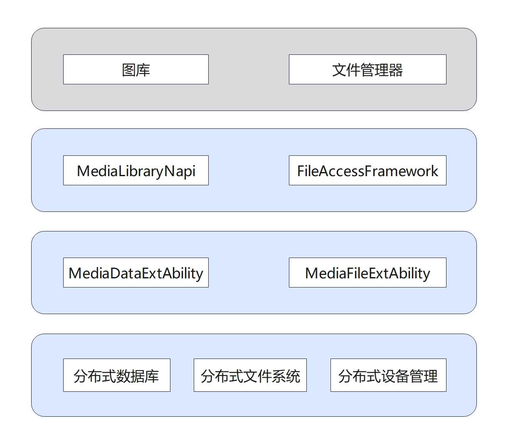

# MediaLibrary组件<a name="ZH-CN_TOPIC_0000001147574647"></a>

- [简介](#section1158716411637)
- [目录](#section161941989596)
- [使用说明](#usage-guidelines)
    - [查询音频资产](#get-audioasset)
    - [创建相册](#create-album)
    - [拷贝图片资产](#copy-imageasset)
- [相关仓](#section1533973044317)


## 简介<a name="section1158716411637"></a>
**图1** medialibrary组件架构图

**medialibrary\_standard** 仓库提供了一系列易用的接口用于获取媒体文件元数据信息。
MediaLibrary接口暂不对外部应用开放, 仅内部使用。

支持能力列举如下：
- 查询音频、视频和图片文件元数据信息
- 查询图片和视频相册
- 媒体文件操作如创建、重命名、拷贝和删除
- 相册操作如创建、重命名和删除


## 目录<a name="section161941989596"></a>

仓目录结构如下:
```
/foundation/multimedia/medialibrary_standard    # 媒体库组件代码
├── frameworks                                  # 框架代码
│   ├── innerkitsimpl                           # 内部接口实现
│   │   └── media_library                       # Native MediaLibrary 实现
│   └── kitsimpl                                # 外部接口实现
│       └── medialibrary                        # 外部 MediaLibrary NAPI 实现
├── interfaces                                  # 接口代码
│   ├── innerkits                               # 内部 Native 接口
│   └── kits                                    # 外部 JS 接口
├── LICENSE                                     # 证书文件
├── ohos.build                                  # 编译文件
├── sa_profile                                  # 服务配置文件
└── services                                    # 服务实现
```

## 使用说明<a name="usage-guidelines"></a>
### 查询音频资产<a name="get-audioasset"></a>
可以使用接口如 **GetMediaAssets**、**GetAudioAssets**、**GetVideoAssets** 和 **GetImageAssets** 来查询不同类型的媒体文件元数据信息。
以下步骤描述了如何使用 GetAudioAssets 接口来获取相应的音频元数据。
1. 使用 **GetMediaLibraryClientInstance** 接口来获取 **Medialibrary** 实例。
    ```cpp
    IMediaLibraryClient* mediaLibClientInstance = IMediaLibraryClient::GetMediaLibraryClientInstance();
    ```
2. 在 **selection** 内设置音频文件的扫描目录。selection 代表媒体公共根目录的相对路径, i.e. "/storage/media/local/files"。接口会在指定目录内递归查找所有音频文件。
    ```cpp
    string selection = "audios/audio1";
    ```
3. 使用 **GetAudioAssets** 接口来查询音频文件。输入参数 *selectionArgs* 暂无作用，接口会返回 *AudioAsset* 的列表。
    ```cpp
    vector<string> selectionArgs;
    vector<unique_ptr<AudioAsset>> audioAssets = mediaLibClientInstance->GetAudioAssets(selection, selectionArgs);
    ```
4. 可以从列表内获取音频元数据信息。
    ```cpp
    for (size_t i = 0; i < audioAssets.size(); i++) {
        cout << audioAssets[i]->uri_ << endl;
        cout << audioAssets[i]->size_ << endl;
        cout << audioAssets[i]->dateAdded_ << endl;
        cout << audioAssets[i]->dateModified_ << endl;
        cout << audioAssets[i]->albumName_ << endl;
        cout << audioAssets[i]->duration_ << endl;
        cout << audioAssets[i]->artist_ << endl;
    }
    ```

### 创建相册<a name="create-album"></a>
MediaLibrary 给应用提供了操作相册的接口, 如创建、修改和删除。以下展示了创建一个新相册的步骤。
1. 使用 **GetMediaLibraryInstance** 接口来获取 **Medialibrary** 实例。
    ```cpp
    IMediaLibraryClient* mediaLibClientInstance = IMediaLibraryClient::GetMediaLibraryClientInstance();
    ```
2. 选择一种相册类型, 可以是 *ASSET_GENERIC_ALBUM*、*ASSET_IMAGEALBUM* 或 *ASSET_VIDEOALBUM* 。
    ```cpp
    AssetType assetType = ASSET_VIDEOALBUM;
    ```
3. 创建一个 **AlbumAsset** 并提供相册名称。如下 "new_video" 相册将在 "/storage/media/local/files/videos" 内被创建。
    ```cpp
    AlbumAsset albumAsset;
    albumAsset.albumName_ = "videos/new_video";
    ```
4. 使用 **CreateMediaAlbumAsset** 接口来创建新相册, 返回值表示相册创建的成功与否。
    ```cpp
    bool errCode = mediaLibClientInstance->CreateMediaAlbumAsset(assetType, albumAsset);
    ```

### 拷贝图片资产<a name="copy-imageasset"></a>
文件操作通过如**CreateMediaAsset**、**ModifyMediaAsset**、**CopyMediaAsset**、**DeleteMediaAsset** 的接口支持。以下例子说明 **CopyMediaAsset** 接口的使用方法。
1. 使用 **GetMediaLibraryInstance** 接口来获取 **Medialibrary** 实例。
    ```cpp
    IMediaLibraryClient* mediaLibClientInstance = IMediaLibraryClient::GetMediaLibraryClientInstance();
    ```
2. 选择一种资产类型, 可以是 *ASSET_MEDIA*、*ASSET_IMAGE*、*ASSET_AUDIO* 或 *ASSET_VIDEO*.
    ```cpp
    AssetType assetType = ASSET_IMAGE;
    ```
3. 确定 **ImageAsset** 的源和目标位置, 目标资产需要指定源拷贝的目标相册名。 
    ```cpp
    MediaAsset srcMediaAsset;
    MediaAsset dstMediaAsset;

    srcMediaAsset.name_ = "image1.jpg";
    srcMediaAsset.uri_ = "/storage/media/local/files/images/001/image1.jpg";

    dstMediaAsset.albumName_ = "images/new_image";
    ```
4. 使用 **CopyMediaAsset** 接口来从源资产拷贝到目标资产相册目录, 接口返回值表示文件操作状态。源文件 "image1.jpg" 将会被拷贝到 "/storage/media/local/files/images/new_image" 。
    ```cpp
    bool errCode = mediaLibClientInstance->CopyMediaAsset(assetType, srcMediaAsset, dstMediaAsset);
    ```

## 相关仓<a name="section1533973044317"></a>
**[multimedia/medialibrary_standard](https://gitee.com/openharmony/multimedia_medialibrary_standard)**
